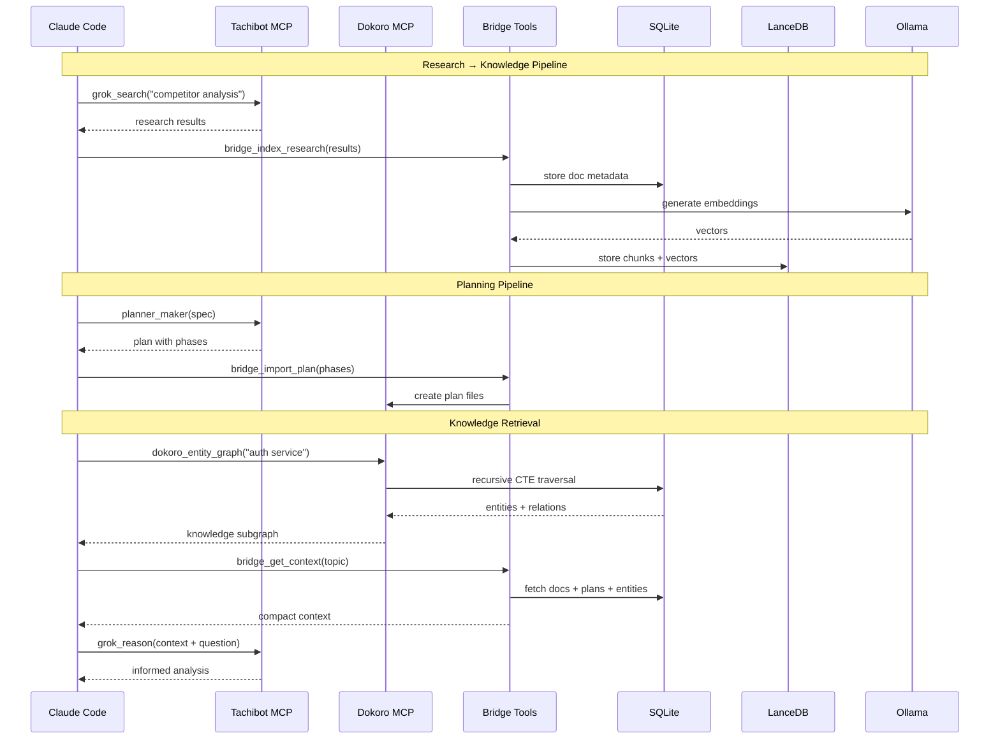
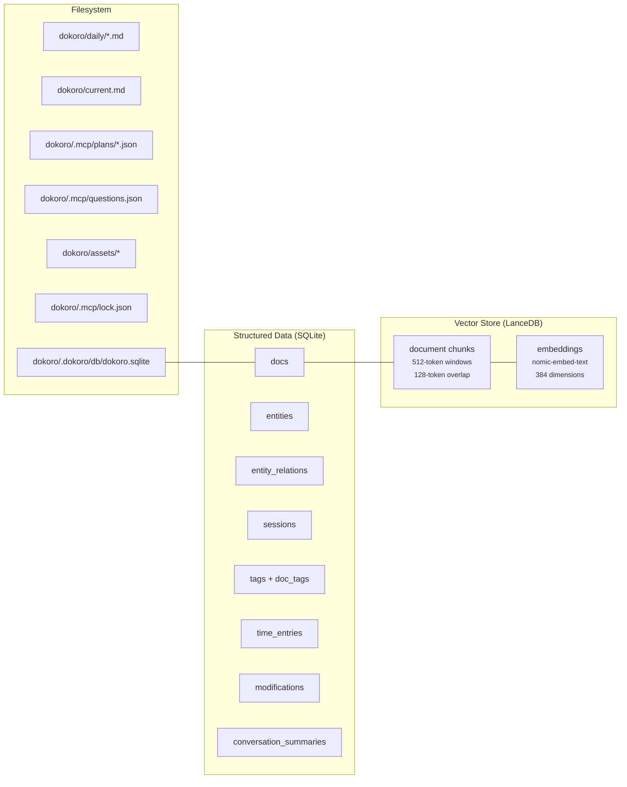

# Dokoro MCP — Architecture

## System Overview

```mermaid
graph TB
    %% ─── Orchestrator ───
    CC["🖥️ Claude Code CLI"]

    %% ─── MCP Servers ───
    subgraph TACHIBOT["⚡ Tachibot MCP"]
        direction TB
        T_REASON["Reasoning<br/><small>grok_reason · openai_reason<br/>qwq_reason · kimi_thinking</small>"]
        T_SEARCH["Search & Research<br/><small>perplexity_ask · grok_search<br/>gemini_search · openai_search</small>"]
        T_CODE["Code Tools<br/><small>grok_code · qwen_coder<br/>kimi_code · minimax_code</small>"]
        T_PLAN["Planning<br/><small>planner_maker · planner_runner<br/>focus · jury · council</small>"]
        T_META["Meta<br/><small>think · nextThought<br/>prompt_techniques · workflows</small>"]
    end

    subgraph DOKORO["📋 Dokoro MCP"]
        direction TB
        subgraph CORE["Core Tools"]
            D_WS["Workspace<br/><small>claim · status · dump · session_log</small>"]
            D_PLAN["Plans<br/><small>create · check · blocker<br/>validate · status</small>"]
            D_Q["Questions<br/><small>add · answer · list · check</small>"]
            D_ASSET["Assets<br/><small>save_image · save_file · list</small>"]
        end
        subgraph KNOWLEDGE["Knowledge Layer"]
            D_ENTITY["Entity Graph<br/><small>entity_graph · entity_extract_deep</small>"]
            D_SEARCH["Semantic Search<br/><small>lancedb_search · hybrid FTS+vector<br/>RRF ranking</small>"]
        end
        subgraph BRIDGE["🔗 Bridge Tools"]
            B_IDX["bridge_index_research"]
            B_IMP["bridge_import_plan"]
            B_CTX["bridge_get_context"]
        end
    end

    %% ─── Storage ───
    subgraph STORAGE["💾 Storage Layer"]
        direction LR
        SQLITE[("SQLite<br/><small>docs · entities · relations<br/>sessions · tags · time</small>")]
        LANCE[("LanceDB<br/><small>vector embeddings<br/>semantic chunks</small>")]
        FS["📁 Filesystem<br/><small>daily/ · plans/ · assets/<br/>current.md · questions.json</small>"]
    end

    %% ─── External ───
    OLLAMA["🦙 Ollama<br/><small>nomic-embed-text · llama3.2</small>"]

    %% ─── Connections ───
    CC -->|"stdio JSON-RPC"| TACHIBOT
    CC -->|"stdio JSON-RPC"| DOKORO

    T_SEARCH -.->|"research output"| B_IDX
    T_PLAN -.->|"plan phases"| B_IMP
    B_CTX -.->|"knowledge context"| T_REASON

    D_WS --> FS
    D_PLAN --> FS
    D_Q --> FS
    D_ASSET --> FS

    D_ENTITY --> SQLITE
    D_SEARCH --> LANCE
    D_WS -->|"workspace_dump"| SQLITE

    D_ENTITY -->|"deep extraction"| OLLAMA
    D_SEARCH -->|"embeddings"| OLLAMA

    B_IDX --> SQLITE
    B_IDX --> LANCE
    B_IMP --> FS
    B_CTX --> SQLITE

    %% ─── Styling ───
    classDef orchestrator fill:#1a1a2e,stroke:#e94560,color:#fff,stroke-width:3px
    classDef tachibox fill:#16213e,stroke:#0f3460,color:#e0e0e0
    classDef dokorobox fill:#1a1a2e,stroke:#533483,color:#e0e0e0
    classDef bridgebox fill:#2d1b4e,stroke:#e94560,color:#fff
    classDef storage fill:#0f3460,stroke:#53a8b6,color:#fff
    classDef external fill:#222,stroke:#e94560,color:#e94560,stroke-dasharray:5

    class CC orchestrator
    class T_REASON,T_SEARCH,T_CODE,T_PLAN,T_META tachibox
    class D_WS,D_PLAN,D_Q,D_ASSET,D_ENTITY,D_SEARCH dokorobox
    class B_IDX,B_IMP,B_CTX bridgebox
    class SQLITE,LANCE,FS storage
    class OLLAMA external
```



## Data Flow



## Storage Architecture



## Per-File Claim Ledger (migration v12)

Multiple agents sharing one worktree coordinate through the `file_claims` table — an **advisory** claim ledger added in migration v12. Conflicts WARN, they never block: enforcement lives in the tools layer (`dokoro_file_claim` / `dokoro_file_release` / `dokoro_claim_list`), not in the schema.

```sql
CREATE TABLE file_claims (
  claim_key TEXT PRIMARY KEY,   -- casefolded normalized root-relative path (one file = one row)
  file_path TEXT NOT NULL,      -- display form
  agent_id TEXT NOT NULL,
  session_id TEXT,
  intent TEXT,
  claimed_at INTEGER NOT NULL,  -- server-assigned unixepoch seconds
  expires_at INTEGER NOT NULL,
  heartbeat_seq INTEGER NOT NULL DEFAULT 0,  -- monotonic renewal counter
  released_at INTEGER           -- NULL = claim is open
);
-- partial index over live claims only
CREATE INDEX idx_file_claims_live ON file_claims(expires_at) WHERE released_at IS NULL;
```

**Advisory semantics.** A claim is information, not a lock: `dokoro_file_claim` returns a structured conflict report (holder, intent, expiry, presence) instead of an error, and `force:true` always wins (recorded as a forced takeover). Acquisition is all-or-nothing inside one immediate SQLite transaction, so the liveness re-check and the conditional takeover cannot interleave with another writer.

**Lease + takeover model (DynamoDB lock-client style).** A claim expires at `expires_at` (`ttl_seconds` default 300, max 3600) unless renewed — re-claiming your own path bumps `heartbeat_seq` and extends the lease. Holder liveness is corroborated at read time against `agent_presence`: an unexpired claim whose holder's heartbeat is stale (> 900 s) may be taken over; a holder with **no** presence row is treated as live while the claim is unexpired (presence is evidence only when present). All timestamps come from one clock domain — SQLite `strftime('%s','now')`, never `Date.now()` — so cross-machine clock skew can't corrupt expiry decisions. Rows are ephemeral coordination state: released or long-expired rows are pruned opportunistically after a day.

## Archive Lifecycle

Finished work moves out of the live workspace automatically; nothing is deleted, and archived material stays readable.

| What | When | Where it goes |
|------|------|---------------|
| Validated plans | Immediately, on `dokoro_plan_validate` (status `validated`) | `.mcp/plans/archive/YYYY-MM/<planId>.json` |
| Completed/validated plans | Sweep: older than 30 days (plan `updated_at` → `created_at` → file mtime) | same month-partitioned archive |
| `daily/*.md` session files | Sweep: filename date older than 7 days **and** outside the current ISO week **and** no live file claim | `archive/daily/YYYY-Www/` (ISO week of the file's date) |

The sweep runs opportunistically on `dokoro_workspace_claim` (never failing the claim) and on demand via `dokoro_archive_sweep` (`dryRun` previews; `status_only` reads the last run). Archived plans remain discoverable: `dokoro_plan_list` shows them marked **(archived)**, read tools resolve them from the archive, and write tools refuse with a read-only error.

**Crash safety:**

- **Atomic index writes** — `.mcp/plans/index.json` is written via temp file + atomic rename. Archiving moves the plan file FIRST and updates the index second; a crash in between is healed on the next run (the plan is found by scanning the archive partitions and the index is repaired).
- **Singleton sweep lock** — `.mcp/archive.lock` is created with `O_EXCL`; a concurrent sweep reports `skipped: locked` (benign). A lock older than the 5-minute TTL is treated as a crashed sweep, broken, and the exclusive create retried once.
- **`archive-status.json`** — every non-dry sweep atomically writes `.mcp/archive-status.json` (last run, counts, per-file errors, last error) for observability; per-file failures are recorded and the sweep continues past them.

## Unified Timestamp Slugs

All generated filenames share one UTC slug from `src/utils/timestamp.ts`:

```
formatTimestampSlug → YYYY-MM-DD-HHhMM-dayname     e.g. 2026-06-10-22h23-wednesday
isoWeekDir          → YYYY-Www (ISO week-YEAR)     e.g. 2026-W24
monthDir            → YYYY-MM                       e.g. 2026-06
```

- Session dumps: `<slug>-session-<topic>.md`
- Plan validation reports: `<slug>-validation-<planId>.md`
- Archive partitions: `archive/daily/<isoWeekDir>/` and `.mcp/plans/archive/<monthDir>/`

Every component — date, time, weekday, week number — is derived from UTC, fixing the classic bug of mixing a `toISOString()` (UTC) date with a `toLocaleDateString()` (local-timezone) weekday name, which disagree around UTC midnight. `isoWeekDir` uses the ISO week-YEAR (Dec 29–31 can fall in next year's W01); note `dokoro_compress_week` keeps its legacy calendar-year week directories for existing-archive stability, so the two can differ around year boundaries.

## Architecture Assessment

**Rating: 7.5/10**

### Strengths

| Aspect | Detail |
|--------|--------|
| **Separation of concerns** | Tachibot = multi-model AI reasoning. Dokoro = structured knowledge. No overlap. |
| **Bridge pattern** | 3 opt-in tools create a clean integration boundary. Zero cost when disabled. |
| **Layered storage** | SQLite (structured), LanceDB (vectors), filesystem (human-readable). Each plays to its strength. |
| **Graceful degradation** | Without Ollama: regex entity extraction works, semantic search unavailable. |
| **Incremental indexing** | SHA-256 content hashing skips unchanged docs. |
| **Modular servers** | core (minimal), unified (all), specialty (search, planning, analytics). |

### Areas to Sharpen

| Concern | Impact | Suggestion |
|---------|--------|------------|
| **42-tool surface area** | Taxes LLM attention window | Dynamic tool discovery or grouping |
| **3 sources of truth** | Plans in JSON files, docs in SQLite, vectors in LanceDB — sync risk | Make SQLite the single source, generate files from it |
| **Ollama-only embeddings** | Ties semantic search to local service | Add fallback provider (OpenAI, local ONNX) |
| **Unidirectional bridge** | Research lost if `bridge_index_research` not called | Auto-bridge via hook or event |
| **File-based locking** | Single lock holder, no multi-user support | Entity graph has `users` table but locking doesn't scale |
